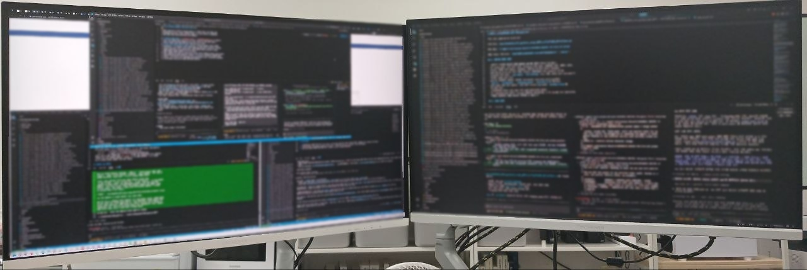

 
UHD(27) + QHD(27)

메모리 분석, 어셈블리어 분석, 리버스 엔지니어링, 패킷분석, 복호화 
C/C++, Python, NodeJS, Go, React, SolidJS, Java, TypeScript 
윈도우 프로그램, 웹, 머신러닝, 딥러닝, 강화학습 
엔진 성격의 기반 코드 작성, 다른 언어로의 포팅 등. 
소스가 없는 프로그램의 수정 및 기능 추가 

